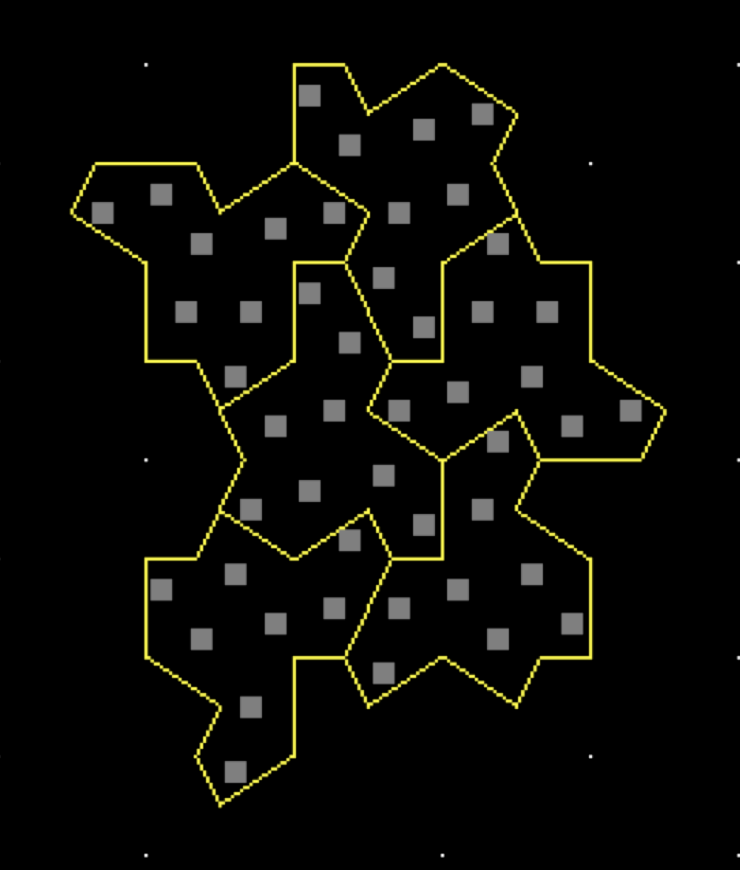

# Drawing the "Hat" tiling

This rathole all started because I wanted a nice cut out for the side
of an imagined ITX pc case.

Subtask: how to plot this picture?  All angles are multiples of 15º

Eight copies of a 60º-90º-120º-90º kite, which can be seen as a mirrored triangle 60º-90º-30º.

A different way at looking at it:

##
Hexagon view

Take a hexagon. Take the midpoint of each side. Draw the six line
segments that connects the midpoints through the center.  This way the
hexagon has been subdivided into six kites.

Tile the plane with those with every other column offset vertically by
a half hexagon.

In each hexagon, label the kites 1 through 6, starting at the top
right, proceeding clockwise.

Finally an Hat tile spans three hexagons A, B, C, with A above B an C
next to both and consists of A2, A3, C5, C4, B2, B1, B6, B5.

Or more abstractly: given a kite k, k+1 is the clockwise next kite of
the same hexagon and kM- and kM+ are the first and second facing kite.

Then Hat is k, +1, M-, -1, M+, -1 -1, -1, -1

## Triangle view

Subdivide the plan into triangles.  Subdivide each triangle into three
kites by connecting the center to the midpoint of the triangle
vertices.  Each kite has angles 60º-90º-30º-90º.  When facing the 60º
angle, call the sides (clockwise) s1, s2, s3, and s4 where s2 and s3
are long (say 1), and s1 and s4 are short (thus √3/2 ~ 0.866)

The Hat is then s2, s4, s3, s1, s3, s3, s3, s3

# Coding it up

Hexagons are well trotten ground.  There are plenty of things written about them, but
I'll use the mapping to the square:

Even grid columns map directly to even hexagon columns, where as odd
grid columns map to odd hexagen columns, shifted down by half a hexagon.

Each hexagon is address by its center position (x,y).
- The hexagon above and below are (x,y+1) and (x,y-1) respectively.
- The hexagon to the right and up is (x+1,y)
- The hexagon to the right and down is (x+1,y-1)
- The hexagon to the left and up is (x-1,y)
- The hexagon to the left and down is (x-1,y-1)

In other words, the clockwise neighbors of a hexagon at p = (x,y) are
0. N[0](p) = (x,  y+1), AKA p+y
1. N[1](p) = (x+1,y), AKA p-x
2. N[2](p) = (x+1,y-1), AKA p+x-y
3. N[3](p) = (x,  y-1), AKA p-y
4. N[4](p) = (x-1,y-1), AKA p-x-y
5. N[5](p) = (x-1,y), AKA p-x

Given a hexagon, taking the six line segments that connects the
midpoints through the center subdivides into six kites.  We can
identify each by the two hexagons it touches, that is
K[0](p)=(N[0](p),N[1](p)), K[1](p)=(N[1](p),N[2](p)),
K[2](p)=(N[2](p),N[3](p)), ..., K[5](p)=(N[5](p),N[0](p)).

Finally a Hat, starting with a kite K[i](p) is (all additions are modulo 6)

- K[i](p)
- K[i+1](p)
- K[i+2](N[i](p))
- K[i+3](N[i](p))
- K[i+4](N[i+1](p))
- K[i+5](N[i+1](p))
- K[i+6](N[i+1](p))
- K[i+7](N[i+1](p))

Ok, all we have to do is code this up
